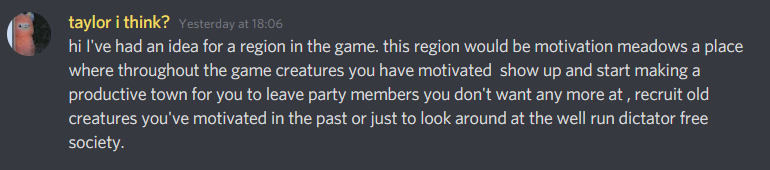

# Story for the Tofu Chan game

*Disclaimer: Nothing here is final. This script is meant as a draft to pitch ideas to the Friends of Tofu Discord Server. Everything from names to the complete story can still be altered.*

## Summary

Tofu lives on earth in his bakery but one day a mysterious traveling Töb comes to him. Tofu has not seen another Töb in years so listens to what they have to say. He is told he needs to go back to his home planet of Pumpernickel urgently on the next SpaceTob flight.
[Confuzzles#7858]

Tofu travels to Pumpernickel and finds out that **[Evil President]** has taken over parts of the planet. The only part that hasn’t been taken over is Töbistan, because they are too powerful. The **Töbs** don’t do anything about the **[Evil President]** because they are too busy sleeping and eating bread.

Unlike the picture of the planet Pumpernickel in the video, the planet isn’t completely brown, but is composed of different regions. The bread region of Töbistan is where the **Töbs** live, and the rest is inhabited by (mainly) other creatures.

## Full story

*empty*

## Characters

### Main Characters

|               Name               |                  Image                  |                                                    Description                                                    | Gender | Species |            Residence            |
|:--------------------------------:|:---------------------------------------:|:-----------------------------------------------------------------------------------------------------------------:|:------:|:-------:|:-------------------------------:|
|     **Tofu Chan** or **Tofu**    |       |                                   **Main character and protagonist of the game**                                  |  Male  |   Tob   |              Earth              |
|           **Tobcuter**           |        |                                 **Tofu Chan's helper and narrator of the story.**                                 |   N/A  |  Robot  |         Apple Macintosh         |
| **Evil President (Casu Martzu?)** |  | **Antagonist of the game. Evil dictator who rules over most of Pumpernickel and seized power in Tofu's absence.** |  Male  |   Tob   | Evil President's unnamed region |

### Side Characters

#### Bosses

##### [Chief Engineer](#chief-engineer-1):

The Chief Engineer is the leader of the Mechanic Hamsters.

## Game Mechanics

### Encounters

The main mechanic of the game is the encounters. When Tofu encounters an enemy, he will need to motivate them to join his side. There will be a motivation counter that indicates how convinced an enemy is.

| Percentage | Outcome                                                                     |
|------------|-----------------------------------------------------------------------------|
| 0-99%      | Demotivation from enemy is reduced by the percentage of the motivation bar. |
| 100-124%   | The enemy is motivated to let you pass, and the encounter is won.           |
| >=125%     | The enemy is motivated to join your   team, and the encounter is won.       |

Your moves in the game can increase (or decrease) motivation, and your goal is to increase the counter to above 100% to win. Getting the counter to 125% can be achieved by using a move that increases their motivation 25 above 100%, or by gaining an extra turn to do extra moves.

#### Recruiting

When the motivation counter reaches 125% before the encounter ends, Tofu gets the option to recruit an enemy to your team.

#### Team

Tofu can convince any creature to become part of his team. The team consists of a maximum of 5 members, including Tofu. Your team shares a universal *Motivation* bar. If this bar drops to 0, the team will lose motivation to go on and will be defeated.

#### Motivation

Motivation acts as a health bar for your team, but as a progress bar for your enemy. The motivation-bar for your team is counted in points, and the enemy’s in percentages. The enemies’ moves will demotivate your team, and your teams moves will motivate the enemy.

### Mini-games

#### Packing mini-game:

Tofu needs to pack for his journey, so you need to go around and pack for your travel. Make sure to pack sufficient amount of bread.
[Confuzzles#7858]

### Open World

**Almost open world**

After completing the tutorial, the game will be almost completely open world (except for some places like locked rooms, unlockable areas and boss areas). There will be quests and side-quests you can follow, but none of them will be compulsory (some will be required to open up certain areas).
[Confuzzles#7858]

### Boss Battles

#### Chief Engineer:

The Chief Engineer will be the last boss battle in the Mechanic Hamsters area, and is one of the final bosses of the Rodent Isles, together with the Master Architect. The boss battle has three phases.

1. The Chief Engineer pilots a Makeshift Mech. He will use this Mech to shoot the **Ball Bro’s** at you, the 3 hamsters that live inside a mechanized hamster ball that will bounce around the arena to try and hit you. Whenever they hit the Engineer, they will be absorbed by him, allowing him to shoot them out again. When the bro’s hit 3 walls without being absorbed by the Engineer, they will become dazed, after which they will return to the Mech. You can befriend the Bro’s when they are dazed and make them fight alongside you to defeat the Engineer. When all Ball Bro’s have been befriended, the Mech loses the arm with the ball-cannon

2. The Engineer will stop shooting the Ball Bro’s at you, but will instead raise the **Turret Trio** from the ground. These 3 hamsters will shoot slow homing rockets towards Tofu from their turrets. Touching a rocket decreases motivation. Luring a missile towards a turret will stun it and allow you to interact with them. Interacting with the Turret Trio allows Tofu to befriend each one of them and turn them on the Engineer. When the Trio have been befriended, the Mech loses one of its legs. 

3. The turrets disappear into the ground. The **Wheel Twins** will appear, 2 hamsters that run in mechanized hamster-wheels. The Engineer can grab the wheels to throw them at you. After a wheel has been thrown and hits a wall, it will be dazed, allowing you to interact with them. Befriending a wheel will stop them from damaging you, and when both wheels are befriended, they will place themselves on both sides of the Engineer and hit him from both sides. This will shatter his power core on his chest, defeating the Mech.

After the Chief Engineer has been defeated, you are able to start an optional quest to help him repair his Mech. Once this quest is completed, you are able to recruit the Engineer into your party. 

#### Master Architect:

Work in progress

## Regions of Pumpernickel

### Töbistan

Residents: Töbs 

Environment: The ground is a brown color, and all vegetation is wheat.

This region is inhabited by the Töbs, the same species as Tofu Chan. The Töbs like to relax and to have fun, and most important of all, they like bread. 

### Rodent Island

Residents: The Mechanic Hamsters, the Architect Rats, the Laid-Back Capybaras.

Environment: Segmented.

Rodent island is inhabited by the three types of rodents: The Mechanic Hamsters, the Architect Rats, the Laid-Back Capybaras. All three species live in different areas, but they interact often.

* The Mechanic Hamsters: Underground. Large mechanical puzzles, secret latches to hidden rooms and paths. 
* The Architect Rats: A big city with confusing and maze-like architecture. Constant constructionwork going on. 
* The Laid-Back Capybaras: Hawaii themed paradise beach. Small thatch beach houses. 

#### The War

The Architect Rats are in a constant war with the Mechanic Hamsters. This is not a war of violence however. The Architect Hamsters assure Tofu of that. *“Wars are fought by those who wish to prove their skills. We do not wish to prove our skill in violence, but rather our expertise in our craft”*. The Hamsters build large puzzles and traps to prove their superior skill to the Architects. The Rats build giant maze-like buildings and towers to prove their superiority to the Mechanics. Both sides have grown accustomed to the war, and don’t really mind the conflict.

#### The Laid-Back Capybaras

The Laid-Back Capybaras live on the beaches of the Rodent Island, and they like to sleep, relax and party! They are not involved in the war, simply because they couln’t care less. The Capybaras like to sunbathe, eat and drink, and do nothing else all day. They live in simple thatch houses because they don’t feel like building anything else, and because it’s all they need. The Capybaras are friendly to all species on Pumpernickel, and they do not really care about the [Evil President] takeover. *“I never met him, but he seems nice I guess. I don’t really care though. Can you pass me the cheese?”*.

#### The Mechanic Hamsters

The Mechanic Hamsters live underground in large mechanical structures. There structures are full of puzzles and traps. The Mechanic city is lit up by electronic lights and powered by large waterwheels. The Hamsters made a canal to allow water from the coast to flow in and power their city.

The Mechanic Hamsters are very proud of their engineering skills. They are also the ones that started the war. They believe that function is more important than appearance. *“Even if you build your houses out of diamond and your cities out of gold, if the fires aren’t warm and the roofs don’t keep you dry, all you’ve built is a pile of metal and stone”*.

#### The Architect Rats

The Architect Rats live in a large city built above the Mechanic Hamsters. They are very proud of their architectural skill. They build their buildings in very confusing and maze-like ways. They are friendly to almost all species on Pumpernickel, except the Mechanical Hamsters. They critisize the Hamsters for their chaotic and ugly machines. *“When your time comes, you will be remembered, not for the ideas you had, but for the glory and gleam of the things you built”*.

### 2 other unnamed regions

### Evil President's unnamed region

### Motivation Meadows

[taylor i think#1915]

Motivation Meadows (or MM) will be an uninhabited area on Pumpernickel, which will be introduced to you later in the game. Whenever you befriend anyone during your adventures and either don’t recruit them, or you don’t reach the 125% motivation needed to do so, they are sent to Motivation Meadows

*[Imagine the Breach from Enter the Gungeon, or the Castle Town from Deltarune: Chapter 2.]*

#### Re-motivate

When an encounter was won, but the motivation bar was between 100-124%, the enemy is still sent to Motivation Meadows, where you will be able to still befriend them in a little mini-game. 

#### Building your own little town

The more people you send over to Motivation Meadows, the merrier. And we need all the hands we can get! The higher the population MM becomes, the more they can accomplish. When you enter MM, a small population counter will be visible in the corner of your screen (along with a maximum population counter, population/maximum), as well as a big population sign. When your population is high enough, you unlock the ability to build different buildings. Each of these buildings can give you different boosts during gameplay, or unlock new shops, mini-games etc., and each consecutive building requires more population than the last. The buildings can be placed in different locations, allowing you to customize the little hopeful town to your hearts desire. 

#### Marketing the game

Marketing a game is best done by building it into the game itself. When someone wants to share their progress in the game, or perhaps the layout of their MM town, they could do so via screenshot, but it could be done better with the internal share button. Clicking the share button would have all villagers of the town run into position, zoom out the camera, and **FLASH**. The act of sharing progress in the game can be made fun and rewarding for the player. 

#### Rise of a Dictator Free Society

With Motivation Meadows providing bonuses to Tofu, and with many players enjoying a Collectathon (*“collecting”* all inhabitants), it is inevitable that players completely finish all building projects in MM. A new *“secret”* ending is then unlocked, in which you show the **[Evil Dictator]** the progress you’ve made on building a society free from dictators and bullies. The dictator, who never thought this to be possible, will come to his senses and realize his mistakes, allowing you to finish the game without imprisoning the dictator. This ending can be unlocked both before and after you already defeated the dictator.

